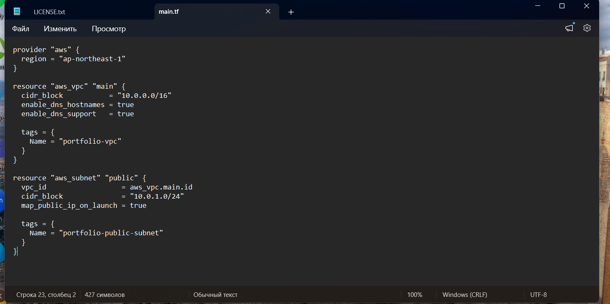
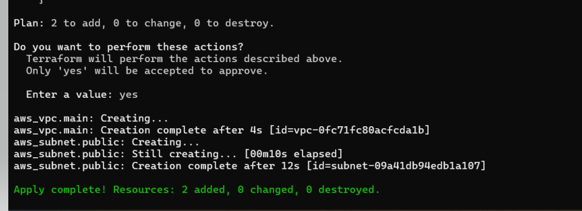
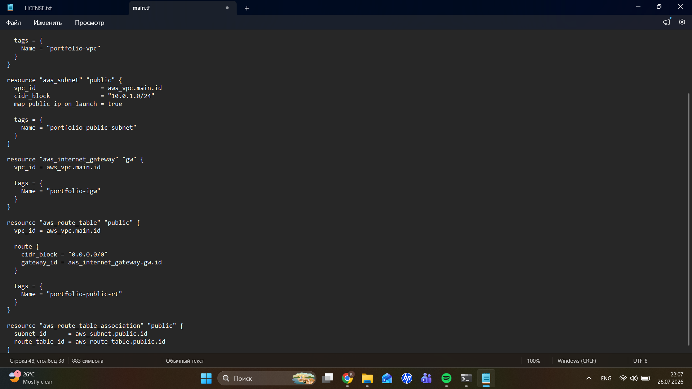
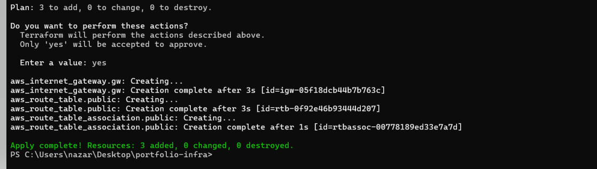
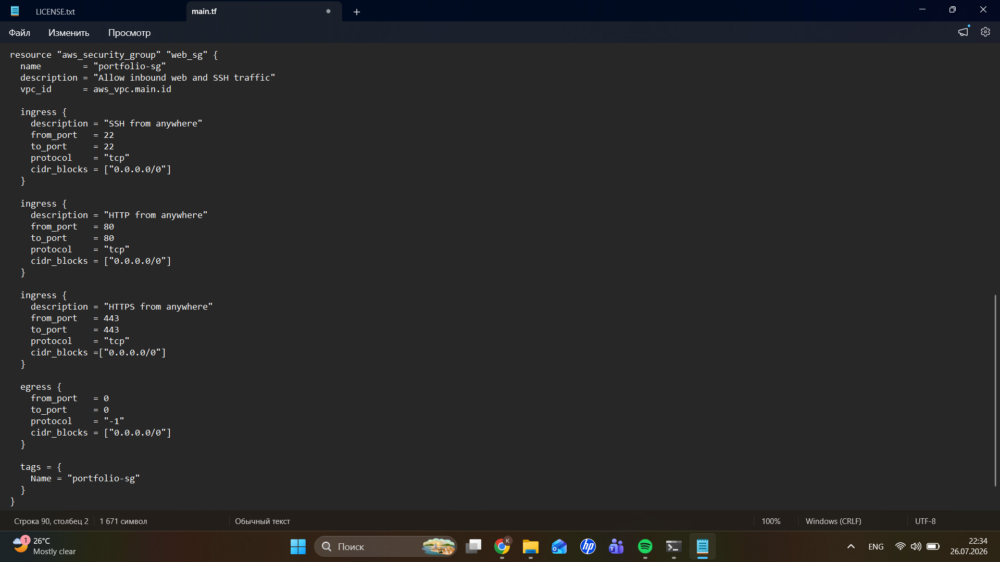
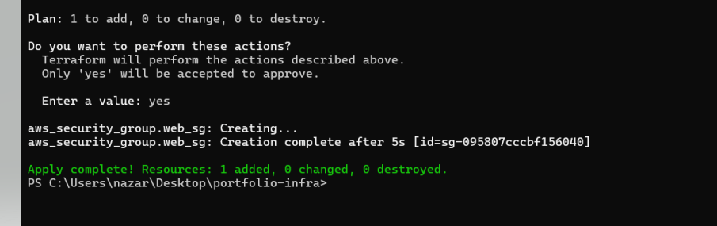
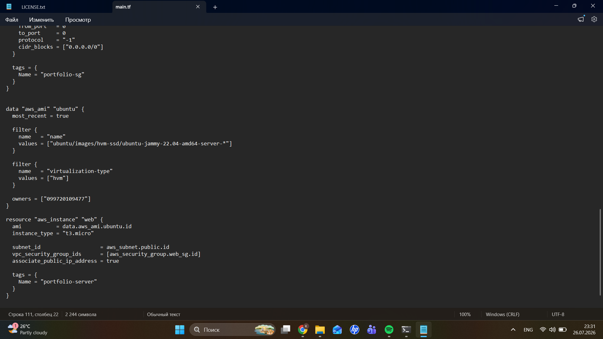
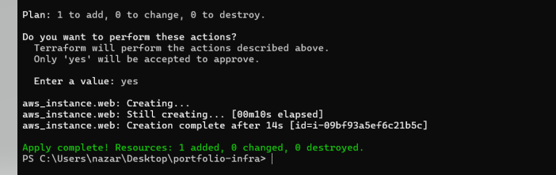

# AWS Infrastructure Deployment via Terraform

## 🇯🇵 概要
Terraformを使用し、東京リージョン（**ap-northeast-1**）に分離されたネットワーク環境（VPC）、セキュリティグループ、およびUbuntu仮想サーバーをコード化（Infrastructure as Code）して構築しました。

## 🇺🇸 Overview
Automated the deployment of an isolated AWS infrastructure in the Tokyo region (**ap-northeast-1**) using Terraform (Infrastructure as Code). The project provisions a VPC, networking components, security groups, and an Ubuntu EC2 instance.

---

# Step 1 — Provider, VPC, and Public Subnet Configuration

## 🇯🇵 実施内容
- AWSプロバイダーの初期化と東京リージョンの指定
- 基本ネットワーク（10.0.0.0/16）のVPC作成
- 自動パブリックIP付与を有効化したパブリックサブネット（10.0.1.0/24）の構成

## 🇺🇸 What I did
- Initialized the AWS provider targeting the Tokyo region
- Created a VPC with CIDR block 10.0.0.0/16
- Configured a public subnet (**10.0.1.0/24**) with automatic public IP assignment

### Code

### Apply Result

---

# Step 2 — Routing Configuration (Internet Gateway & Route Table)

## 🇯🇵 実施内容
- インターネットゲートウェイ（Internet Gateway）の追加
- デフォルトルート（0.0.0.0/0）を持つルートテーブルの作成
- サブネットとの関連付け

## 🇺🇸 What I did
- Added an Internet Gateway for external connectivity
- Created a Route Table with a default route (**0.0.0.0/0**)
- Associated the Route Table with the public subnet

### Code

### Apply Result

---

# Step 3 — Security Group Configuration

## 🇯🇵 実施内容
- Security Group（portfolio-sg）の作成
- SSH（22）、HTTP（80）、HTTPS（443）のインバウンドルールを設定
- すべてのアウトバウンド通信を許可

## 🇺🇸 What I did
- Created a Security Group (**portfolio-sg**)
- Configured inbound rules for:
  - SSH (22)
  - HTTP (80)
  - HTTPS (443)
- Allowed all outbound traffic

### Code

### Apply Result

---

# Step 4 — EC2 Instance Deployment

## 🇯🇵 実施内容
- Data Sourceを利用して最新のUbuntu 22.04 LTS AMIを取得
- t3.microインスタンスを作成
- パブリックサブネットおよびSecurity Groupへ接続

## 🇺🇸 What I did
- Retrieved the latest official Ubuntu 22.04 LTS AMI dynamically using Terraform Data Sources
- Provisioned an EC2 t3.micro instance
- Attached the instance to the public subnet and security group

### Code

### Apply Result

---

# 🛠 Tech Stack

- Terraform
- Amazon Web Services (AWS)
  - VPC
  - Subnet
  - Internet Gateway
  - Route Table
  - Security Group
  - EC2
- Ubuntu Server 22.04 LTS

---

# 📚 What I Learned

- Building AWS infrastructure declaratively with Terraform
- Designing cloud networking using VPCs, subnets, Internet Gateways, and Route Tables
- Managing network security with Security Groups
- Provisioning EC2 instances using Terraform Data Sources
- Applying Infrastructure as Code (IaC) best practices
